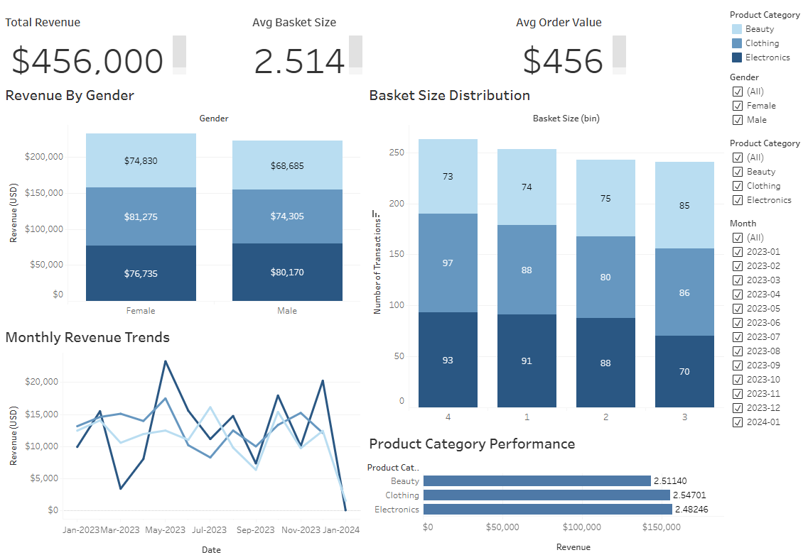

# Retail Sales Insights

### Uncovering customer trends, product performance, and revenue drivers using SQL and Tableau

This project analyzes transactional retail data to identify which products sell best, how customer segments behave, and what store-level actions can drive more revenue. The dashboard and recommendations support multiple departments — from marketing and finance to inventory and operations.

---

## Executive Summary

This analysis answers three high‑impact questions that matter to retail decision‑makers:

1. **Which customer segments contribute most to revenue?** By analyzing revenue and basket size by gender, we identify the customer groups that drive sales.
2. **How does purchase timing affect revenue?** Aggregating sales by month reveals seasonal peaks and troughs; these patterns guide inventory planning and marketing calendars.
3. **Which products should be prioritized?** Ranking product categories by total and average revenue highlights where merchandising and promotional budgets should be focused.

### Dashboard Overview

The planned dashboard (to be built after finalising the analysis) will include:

- **Segment‑based revenue breakdown:** charts summarizing revenue and average basket size by gender.
- **Monthly revenue trend:** a line graph showing seasonal fluctuations across the year.
- **Product category comparison:** a bar chart ranking Beauty, Clothing and Electronics by total revenue and average revenue per transaction.

> 🔗 [View the live dashboard on Tableau Public](https://public.tableau.com/views/RetailSalesInsights_17537521330210/RetailSalesInsights?:language=en-US&:sid=&:redirect=auth&:display_count=n&:origin=viz_share_link) 


---

## Actionable Recommendations

- **Target high‑value customer segments.** Female customers generated slightly higher total revenue and purchased marginally more items per transaction than males. Tailored promotions (e.g., bundle offers or loyalty perks) could increase their lifetime value. 
- **Prioritise beauty products.** Beauty products delivered the highest total revenue and the highest average ticket value. Ensure adequate stock levels, highlight premium SKUs and consider bundling related items to maximise profitability. 
- **Align marketing with seasonal peaks.** May 2023 produced the largest revenue spike, while March and September were slower months. Plan promotional campaigns and staffing schedules around these peaks and throughs to optimize resources.
- **Nurture high‑value transactions.** Several customers made large purchases (US $2,000). Identifying and rewarding these customers through VIP programmes or personalised outreach could enhance retention and encourage repeat purchases.

---

## Deep Dive: Analytical Approach

### Dataset Overview

The dataset analyzed in this project originates from Gigasheet’s sample data gallery. According to the provider, the table contains **1,000 rows and 10 columns** with fields such as transaction ID, date, customer information, product category, quantity and price. These columns allow computation of revenue (quantity × price), basket size (number of items) and derived temporal dimensions (month, quarter). The data spans transactions between January 2023 and January 2024.

### Analytical Steps

1. **Data import & cleaning:** The raw CSV file was loaded into pandas and column names were standardised (e.g. `Date` → `SaleDate`, `Price per Unit` → `PricePerUnit`). Additional fields were computed: **Revenue** (`Quantity × PricePerUnit`), **Basket Size** (a copy of `Quantity`), **Month** (derived from the sale date) and **Quarter**. These transformations ensure the data is consistent and ready for analysis.
2. **Aggregation:** Revenue and basket size were aggregated by gender and product category to understand customer and product performance. Monthly revenues were summed to identify seasonal patterns.
3. **Visualisation:** Bar charts and line charts were created using seaborn/matplotlib to communicate the findings clearly. These visuals will form the basis of an interactive dashboard.

---

## Scripts

This repository includes scripts to clean the raw data and to reproduce the analyses using both Python and SQL. These files can be run independently to generate the tables and metrics described in this report.

### Data cleaning

- **`clean_retail_data.py`** – reads the raw CSV (`retail_sales_full_dataset.csv`) with the original column names, renames the columns, computes `Revenue`, `Basket Size`, `Month` and `Quarter`, and writes a cleaned CSV (`retail_sales_clean.csv`). Use this script as the first step before performing any analysis.

### Python analysis

- **`q1_revenue_by_gender.py`** – summarises transaction count, total revenue, average revenue and average basket size by gender.
- **`q2_monthly_revenue.py`** – aggregates total revenue by month to reveal seasonal patterns.
- **`q3_product_performance.py`** – ranks product categories by total and average revenue and reports the average unit price.

### SQL transformation and analysis

- **`clean_retail_sales.sql`** – SQL query that applies the same cleaning logic within a database (renaming columns and computing derived fields).
- **`create_retail_sales_table.sql`** – defines the schema for a cleaned retail sales table to store the transformed data.
- **`q1_segment_revenue.sql`** – returns gender‑based revenue and basket size metrics.
- **`q2_timing_patterns.sql`** – sums revenue by month to analyse timing/frequency patterns.
- **`q3_top_products.sql`** – ranks product categories by revenue and average unit price.

### Legacy scripts

- **`data_analysis.py`** – an earlier script that loads a cleaned CSV, summarises the data by gender, product category and month, and generates bar/line charts.

---

## Repository Structure

```
retail-sales-insights/
├── data/
│   ├── retail_sales_full_dataset.csv       # raw dataset (1 000 rows × 9 columns)
│   └── retail_sales_clean.csv              # cleaned dataset with derived fields
├── python/
│   ├── clean_retail_data.py                # Python script to clean the raw data
│   ├── q1_revenue_by_gender.py             # Python analysis for question 1
│   ├── q1_revenue_by_gender.py             # Python analysis for question 1
│   ├── q2_monthly_revenue.py               # Python analysis for question 2
│   ├── q3_product_performance.py           # Python analysis for question 3
│   └── data_analysis.py                    # legacy all‑in‑one analysis script
├── sql/
│   ├── clean_retail_sales.sql              # SQL transformation of the raw data
│   ├── create_retail_sales_table.sql       # SQL DDL for the cleaned table
│   ├── q1_segment_revenue.sql              # SQL analysis for question 1
│   ├── q2_timing_patterns.sql              # SQL analysis for question 2
│   └── q3_top_products.sql                 # SQL analysis for question 3
├── images/                                 # charts and dashboard previews
├── README.md                               # project overview and documentation
└── LICENSE
```

---

## Tools Used

- **Python (pandas, seaborn, matplotlib):** for data import, aggregation and visualization.
- **SQL (MySQL):** used to reproduce core insights with joins, groupings, and date filters.
- **Jupyter Notebook / Tableau:** for exploration and dashboard prototyping.

---

## Data Source

- **Provider:** Gigasheet sample data gallery
- **Description:** A retail sales dataset with transaction details, dates, customer demographics, product categories, quantities and prices.
- **Size:** 1,000 rows × 10 columns
- **Link:** [Gigasheet Retail Dataset](https://www.gigasheet.com/sample-data/retail-sales-dataset)

---

## About the Analyst

Jeremy Gutierrez – Data Analyst focused on turning raw data into actionable insights and communicating findings clearly. 
Let’s connect: [LinkedIn](https://www.linkedin.com/in/jeremy-gutierrez-4502391bb/) | [GitHub](https://github.com/JZambrana1612) 
